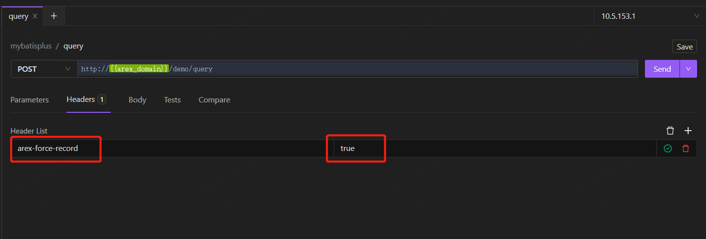
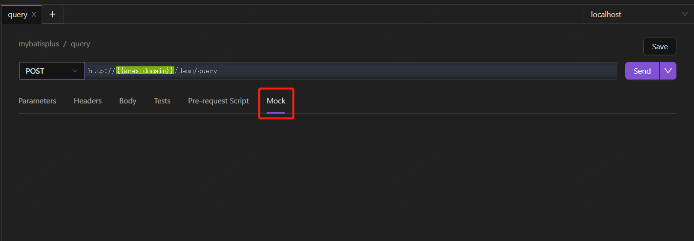

**Mock** is to replace the dependent objects with mock objects. These mock objects simulate or ‘mock’ the behavior of real objects and exhibit the exact characteristics of the authentic ones, making the testing process faster with mock objects.

With AREX, you can verify the correctness of your system by recording a real online request and replaying it in your test environment. AREX's powerful mock mechanism will automatically mock all third-party dependencies during the recording process, perfectly reproducing the production data environment, resolving the challenges of constructing data and writing test cases in regression testing.

### Use Cases

- **Reproduce the online issues in test environment**：If you need to debug a specific request in the production environment, you can force record the request with AREX, and then run the request again in test environment for debugging. During the recording process, AREX will collect and mock all dependencies, making the local data environment almost identical to the production environment, thus ensuring a successful reproduction of issues.

- **Test the new feature**：You can also record an online request in the same way and make corresponding changes in the returned mock data to meet the new functionality. With AREX, you can automatically mock the data required for this request without having to manually construct the data, which is very convenient.

## Step 1: Record one request

1. Create a new request and specify its details with the case that needs to be recorded, including the request line (URL and method), request header, and request body.

2. You can select the **action.record** icon  to force record the request as test cases.

    

    And the **Key**: "arex-force-record" and **Value**: "true" will be added in the request **Header**. Then select **Send** to record the request.

    

## Step 2：Edit Mock data

1. After sending the request, a Record ID with **Key**: "arex-record-id" and **Value**: "Record ID" will be generated in the response message.

    

2. The newly added **Mock** is all the dependencies' data mocked during the recording process.

    

If you are unsatisfied with the mocked data, you can manually modify it to meet the needs of the new functionality. Select **Save** to save your changes, then you can request the new functionality interface in the test environment, and verify its correctness using the modified mock data.

## Step 3：Replay the request

1. Create a new request and enter the URL that needs to be tested in your test environment.

2. Enter **Key**: "arex-record-id", **Value**: the Record ID obtained previously in the request header.

3. Select **Send** to replay the request in your test environment for debugging purposes.
