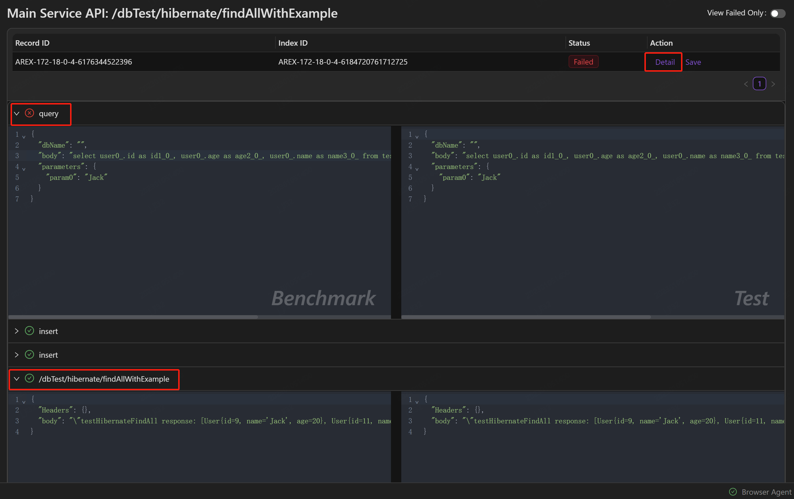
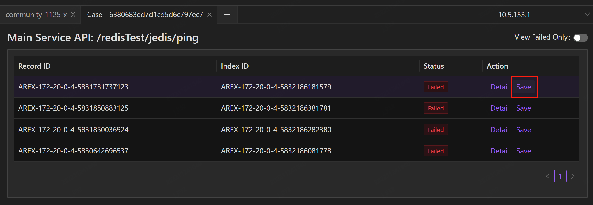
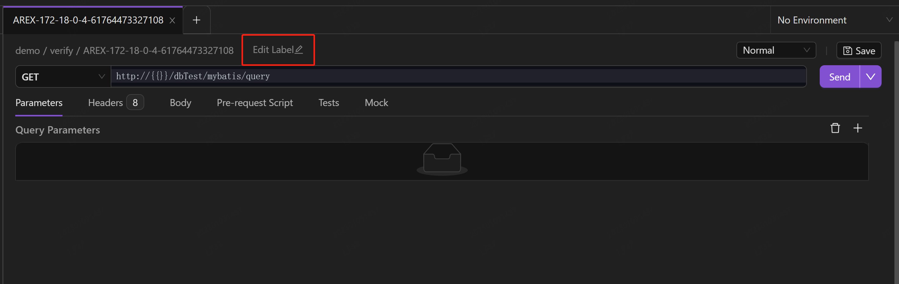

### Scenarios

1. AREX can record real online traffic to generate rich test cases, which can then be solidified and expanded based on your needs to increase the number of test cases.

2. Test cases recorded by AREX will be deleted if they exceed the validity period. By saving test cases manually, they can be retained for a longer time and replayed anytime you want.

## Creat a collection to save test cases

First, you need to creat a new collection to save the recorded test cases.

1. Select the **+** icon besides **Collection** to creat a new collection.

    

2. Select **Add Request** in the dropdown list of the new collection to creat a new request, storing test cases that need to be saved later.

    

## Save test cases

1. Select **Replay** in the sidebar and select the application you are working with.

    

2. From the replay execution list, select the specific replay task in which you want to save test cases and view the recorded test cases by selecting **Case Table**.

    

    Select **Detail** to view the details of the test cases:

    
    
    The validation of the main interface in AREX is mainly based on comparing the differences between the recorded and replayed response messages, while the validation of other external dependencies is validated by comparing their request message. 
    
    The left side shows the request message of the external dependencies and the response messages of the main interface during the recording process, such as database calls. 
    
    The right side shows the request content of the dependencies and the response messages of the main interface during the replay process.
    
    -  icon indicates points of difference, 
    
    -  icon indicates no point of difference.

3. Select **Save** to save the case to the collection created previously.

    

    

## View test cases

Once the test case is saved, you can view it under the corresponding collection request with a similar pattern as an API request.

You can categorize your test cases by adding tags. Just place your cursor on **Add Tag** and select the  icon. 

Tags can be pre-configured by selecting the **Edit Workspace** icon >> **Labels** tab.

The request URL is configured with the path of the interface by default, you can enter the test port in front of the path and send request to debug.

The **arex-record-id** in the request **Headers** is the recording ID, if you want to replay the case in test environment, you can add the arex-record-id in the request header of the new request, and send the request.

The **Mock** tab shows all data mocked from the production environment and third-party dependencies during the recording process. 

The left side shows the main interface and external request messages that were recorded, and the right side shows the corresponding response messages. 

The mocked data can be edited, so if you are not satisfied with it, you can manually modify it and select "Save" to save it. Then, in next repaly, you can request by using the modified mock data.

