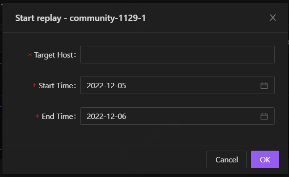
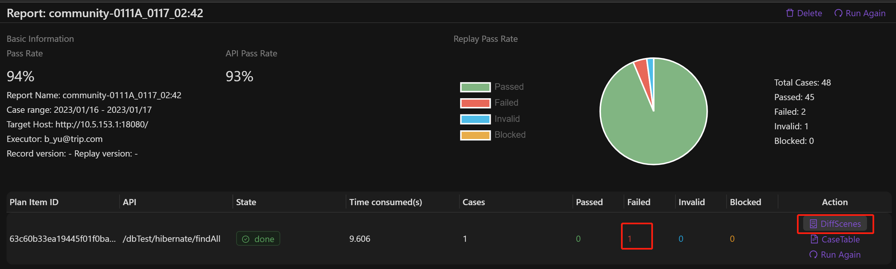
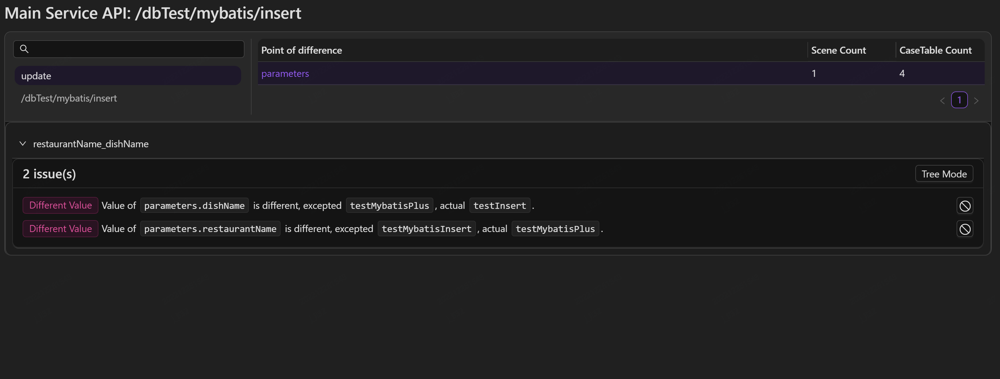
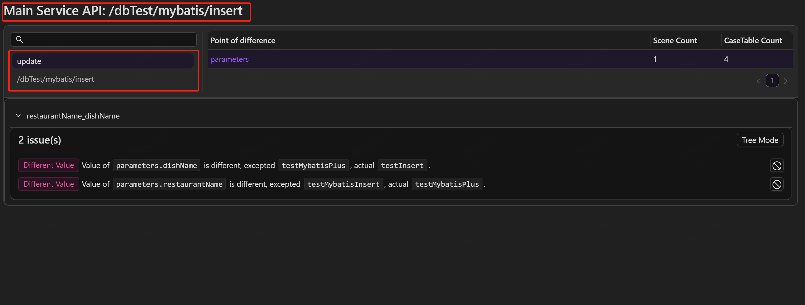
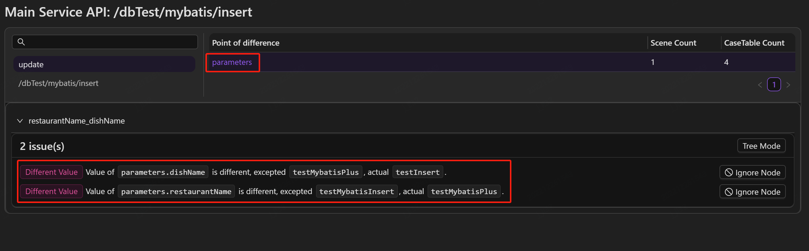
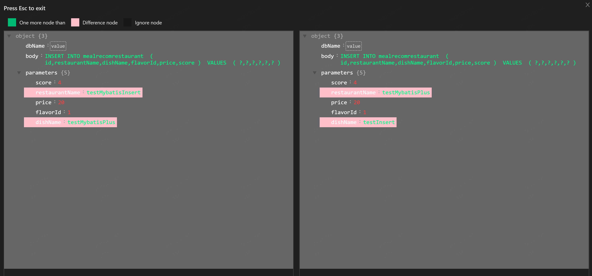

## Start replay

Once the application is set up, you are ready to replay recorded traffic to test.

Select the application which you are working with. The workspace displays previous replay lists. To begin the replay task, select "Start Replay" in the top right corner.

Enter the host that you want to test in the local/test environment in the **Target Host** field, and then specify the start and end time for replaying the recorded cases within this timeframe.

### Report overview

After running, a detailed report will displayed in the workbench.

Select the  icon to run again.

**Pass Rate**：Ratio of successful replayed cases to all replayed cases (A successful replayed case means no difference compared with the recorded case).

**API Pass Rate**：Ratio of successful replayed interfaces to all replayed interfaces under **Target Host** (A successful replayed interface means no failed replayed cases in it).

**API**：List of all the interfaces accessed in the replay.

**State**：The state of replay，"**running**" means it's currently in progress, "**done**" means the replay is completed, "**interrupted**" means the replay was interrupted and you can select the "**Run again**" icon to run the test again.

**Time consumed(s)**：Execution time of the replay test in "s".

**Total Cases**：The number of replayed cases of this interface.

**Passed、Failed、Invalid、Blocked**：The number of replayed cases that passed, failed, invalid, and interrupted, respectively.

## Analyze response message differences

 **Failed** in the interface indicates that there are differences between recorded and replayed return response messages.

Select **DiffScenes** to analyze the differences.

The top left area displays the primary interface being tested, while the bottom area displays the primary interface and its external calls to third-party dependencies, such as databases, etc.

**Point of difference**：This displays all the difference nodes in the replay test. For main interface validation, it mainly verifies the difference between the recorded and replayed response messages. For the validation of other external calls to third-party dependencies, it verifies by comparing the request message, such as the SQL statement for the database.

**Scene Count**：The number of scenes where the difference nodes occurs.

**Case Count**：The number of cases where the difference nodes occurs.

Select the node in **Point of difference** to view the difference in response message. Hover over the **Path** and it will display the specific location of the node in the response message.

Select **Tree Mode** to see the differences in tree mode.

If you have some nodes that do not need to be compared, such as time, IP, and other fields that are not related to the business, you can click "Ignore Node" to skip these nodes, thus improving the efficiency of the replay.

Select **Diff Match** to match the difference.

