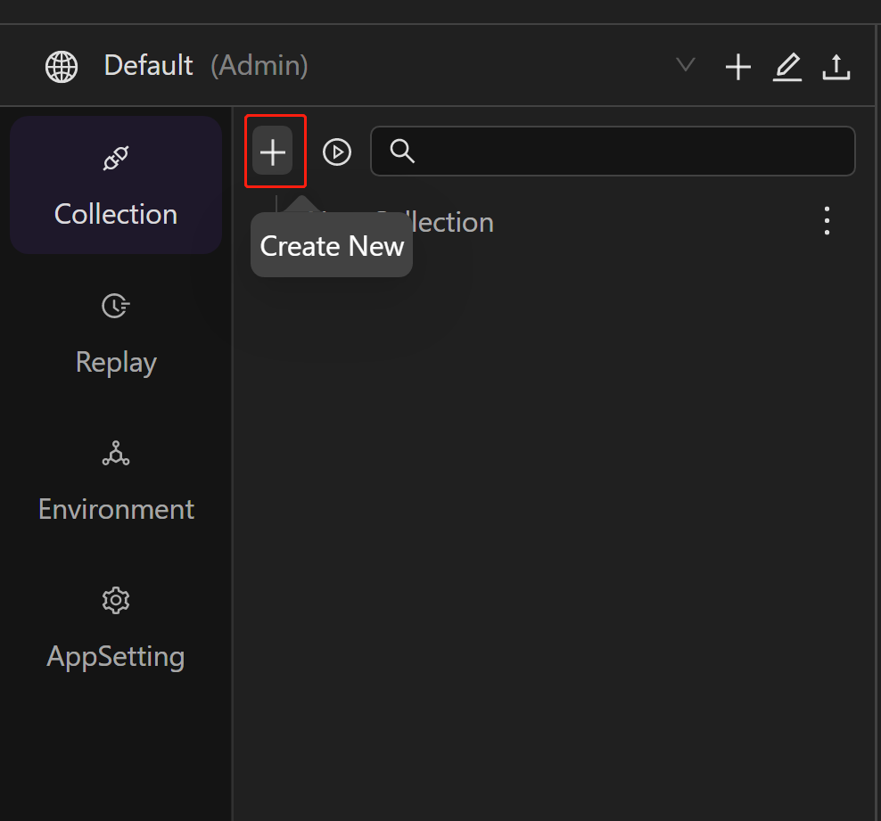
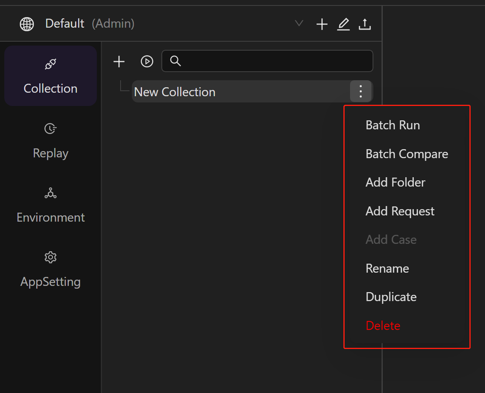

## Creating collection

Collections are a group of saved requests. You can save your requests in groups by creating collections, which can help you manage requests better.

To create a new collection, select **Collection** > **New** from the sidebar.

Or select the **+** icon to create a new collection：

Once created, you can manage all your collections under **Collections** in the sidebar. You can also add new subsets/folders under collections.

To customize and configure the new collection, click directly on the collection:

1. Select **Authorization** to configure authorization details for the collection. If you do not want to expose the interface to the public, you can use authorization. The authorization process will verify that you have permission to access the data required by the server, and when you send a request, you usually need to include parameters to ensure that the request has permission to access and return the required data. By default, this will take effect for requests under the entire collection/folder. If you need to modify the authorization type for a particular request, you can do so separately in that request.

2. Select **Pre-request Script** to define a pre-request script for your collection, which will run before requests are sent to the server.

3. Select **Tests** to define a test script for your collection, which will run after a response is received.

## Creating a workspace

You will be in your default personal workspace when first log in AREX. You can not only create various workspaces for your personal use, but also invite your team to collaborate in your workspace to manage **Collections**, share **Environments** etc.

To create a new workspace:

1. Select the **+** icon in the upper right to **Add Workspace**. You can also select other workspaces from the dropdown list.

    

2. Enter a Name for your workspace and click the **√** icon to save。

    

3. Once created, you can select the  icon in the upper right to **Edit Workspace**, where you can edit the name of the workspace, manage collaborators, and delete the workspace.

    

You can also invite other users to collaborate in a workspace via email by selecting **Invite** in the upper-right corner. There're **Admin**, **Editor**, and **Viewer** three roles.

## Sending request

You can use AREX to create and send API requests.

1. Select **+** icon in the workbench to open a new tab.

    

2. Enter the request URL.

3. Select **Send**.

    
