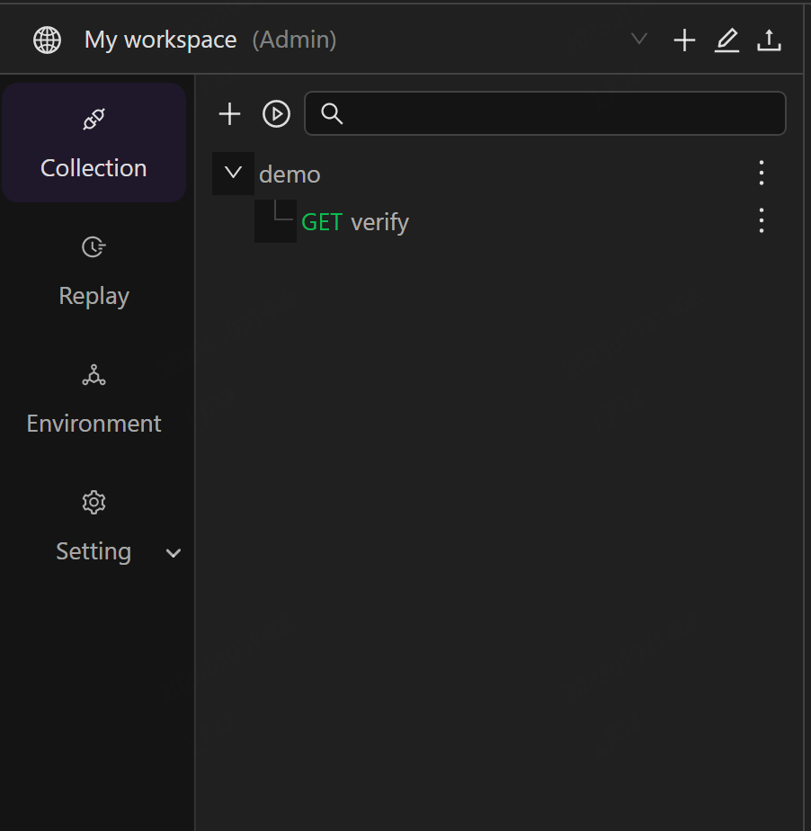

After installation, you can access the **AREX-UI** via **Chrome** browser:

- If the port configuration has not been modified, access port 8088 directly (port 8088 exposed by Docker Compose) http://0.0.0.0:8088/
- If the front-end is deployed independently and the port has not been modified (default port 8080) http://0.0.0.0:8080/
- If the port has been modified, access according to the modified port.

## First Login

For the first login, you need to enter your personal E-mail. After receiving the verification code, select **Login** to complete the login.

You can also log in as a guest by selecting the **Guest**, but you will have limited access and will not be able to use the invite or case sharing feature.

## Chrome Plugin Installation

Before using, please install the Chrome plugin according to the browser prompt to remove the browser cross-domain restrictions.

In the redirected page, select **Add to Chrome** option to download the plugin.

If you cannot access the Chrome extension, it also can be installed locally by downloading from the [Release](https://github.com/arextest/arex-chrome-extension/releases).

1. Download `arex-chrome-extension.zip` and unzip it.

    

2. Open the Chrome browser and enter `chrome://extensions/` to access the extension page. Click on the upper right corner to select developer mode. Then select the previously extracted folder by selacting **Load unpacked extension**.

    

3. Installation complete.

    

## Interface Overview

overview of Postman's primary interface areas

The interface of AREX-UI consists of three primary areas: **Header**, **Sidebar**, and **Workbench**.

### Header

- Invite: Invite others to collaborate on the same Workspace.

-  Settings: Switch between Dark/Light mode and Chinese/English mode.

- Sign out：You can sign out of your current account.

### Sidebar

- Workspace：Select the dropdown list to switch Workspaces; Select **+** to create a new workspace; Select  icon to configure the current workspace；Select  icon to import a local file as a collection in the current workspace.
- Collection：Groups of saved requests. You can send requests and manage your test cases here.
- Replay: Execute AREX replay and view the reports.
- Environment: Create a new environment and configure environment variables.
- Setting: Set up the recording application.

### Workbench

The workbench is the primary area when performing operations such as API testing, replay testing, and comparison testing. The tab bar allows you to quickly manage various requests, collections, and replay, and the top right corner allows you to quickly select the environment.

#### Tabs

Tabs allow you to organize and work between requests.

You can open a new request by selecting **+** in the workbench.

#### Switching environments

As needed, you can quickly switch to the environment you need in the upper right corner of the page. Select the appropriate environment to access the variables in that environment.

