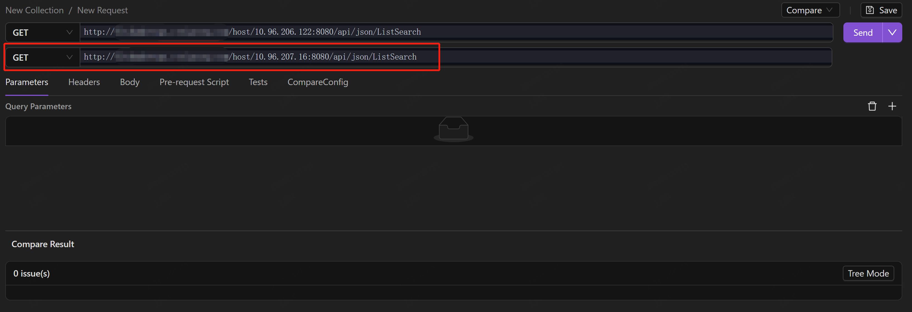
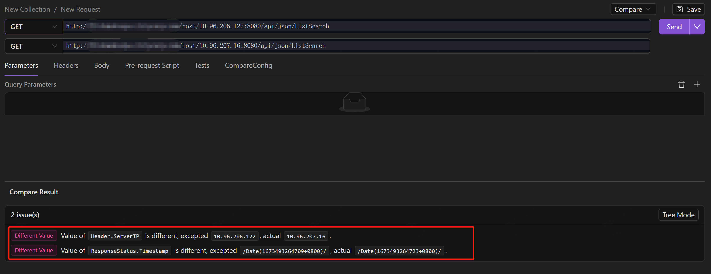
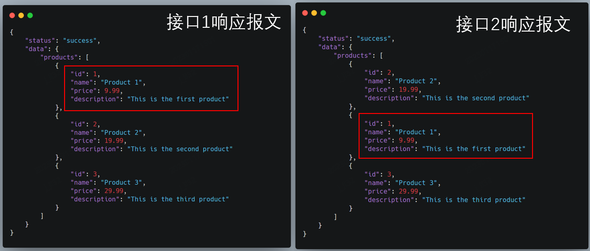

AREX comparison testing involves sending the same request message to different API addresses and comparing the differences in the response messages.

## Scenarios

- When the back-end system is refactored (or architecture upgraded), compare the response data returned from the new and old system interfaces to ensure that the redevelopment did not bring any interface problems.

- Compare new and old version interfaces for acceptance testing.

## Comparison testing

1. Create new collection.

    

2. Create new request.

    

3. Select the request method, set request URL, configure parameters, request headers, request body, and pre-request scripts and test scripts (if needed) in accordance with your needs. Then, click the **Compare** option in the dropdown list under the **Normal** button in the upper right corner of the page to switch to the comparison mode.

    

    Enter the URL of the API to be compared. 

    

4. Select **Send** to examine the comparison result in the **Compare Result** tab.

    

    Hover over the path and it will display the specific location of the node in the response message.

    

## Configuration

Interferences such as random numbers or inconsistent order of array elements may cause differences in the comparison results and increase the cost of debugging for testers. To increase the efficiency of comparison testing, nodes in the response message can be configured in advance.

Select the  icon, enter the response returned from your request in the code box manually, and click **save**.

### Nodes Ingnore

If there are data such as timestamp, random numbers, IPs in the response, even if the system code does not change, there will be discrepancy points in the comparison result. In this case, you can pre-configure these nodes to be ignored to reduce interference.

After saving the response, the **NodeIgnore** tab will display all the nodes in the response returned from the request. Simply select the nodes you want to ignore.

### Nodes Sort

Usually, an array in the response contains multiple elements, and the order of elements in the responses returned from two different request URLs often differs, resulting in differences in comparison results even though the returned response are actually the same. As shown in the following picture:

By configuring the keys of the elements in the array (e.g. `id` and `name` in the above example) in **NodeSort** tab, we can avoid the failure of comparison due to different ordering of the elements in the array of the response during the matching process.

After saving the response, the interface will automatically display all nodes of the response (only arrays can be sorted). Click the **+** icon, select one or more keys under the array, and click "Save" to save. Take note, you may choose a key group that can uniquely identify the array element, such as "id" + "name".

In the next comparison, AREX will no longer compare elements one by one in the order of the array elements, but will find the same element in the two sets of response through the previously set key group and compare them one by one to avoid differences due to inconsistent element order.
