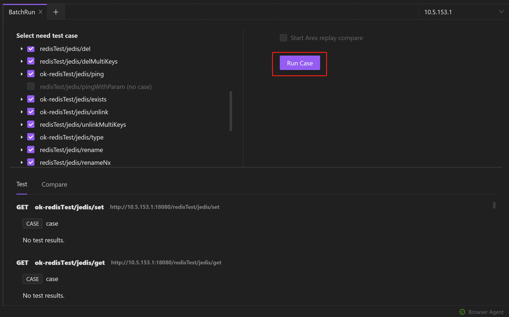
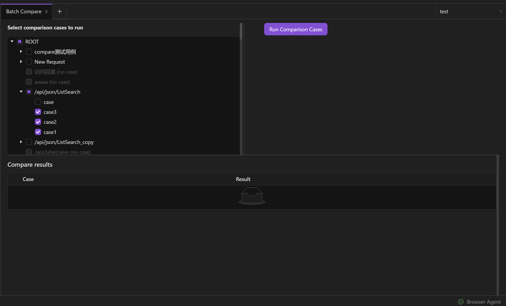
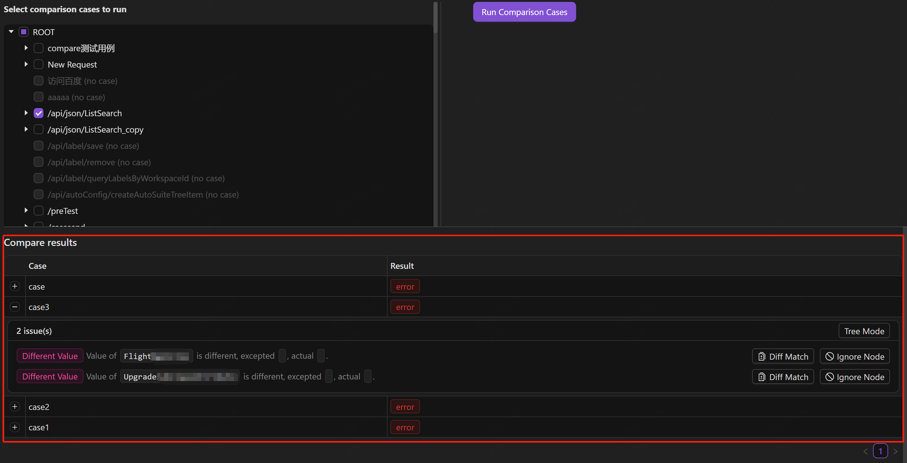

AREX allows you to automate API testing by running a collection of saved requests. This is a convenient way to perform automated API testing on a large number of test cases at once, rather than running each test case individually.

## Scenarios

1. **Batch run test cases**. When testing multiple scenarios for the same URL, you can save requests in different scenarios as test cases and run it directly the next time without having to re-add the request details. The **Batch Run** enables you to run multiple test cases in a collection at once, making regression testing more efficient and convenient.

2. **Batch run comparison cases**。In order to compare the response messages from two different request URLs, we can use AREX for comparison testing. Typically, there are many scenarios to be tested in comparison testing, and manual comparison for each scenario can be time-consuming and result in low testing efficiency. By saving every comparison scenario as test cases and running them in batch, we can automate the testing process and improve the speed and efficiency of software testing.

## Create colletions to store test cases

1. Select **Collection** in the sidebar and select the **+** icon to create a new collection.

    

2. Select **Add Request** from the dropdown list of the collection to create a new request or comparison request, and then select **Save**.

    

    

3. Select **Add Case** frome the dropdown list of the request to create a new test case. Test cases will automatically inherit the configuration of Request, reducing the cost of designing test cases.

    

4. You can categorize your test cases by adding tags. Hover over the **Add Tag** and select the  icon.

    

    Tags can be pre-configured by selecting the **Edit Workspace** icon >> **Labels** tab.

    

5. **Description** of test cases makes it easier for others to understand the purpose and expected results of the test cases, improves readability, and provides a better understanding of the testing content. To add a description, move your cursor to **description** and select the  icon.

## Batch Run

1. Select **Batch Run** from the dropdown list of the collection which you want to run.

    

    Or you can hover over the  icon in the sidebar and select **Batch Run**. All collections within the current **workspace** will be selected in this way.

    

2. Select the test cases from the list and select **Run Case** to run.

    

You can view the test results after running.

## Batch Compare

**Batch compare** refers to the capability of running multiple comparison tests in AREX at once, as a batch. This feature allows you to send the same request to different environment addresses and compare the responses from each, without having to manually compare each scenario. This makes the testing process more efficient and streamlined.

1. Select **Batch Compare** from the dropdown list of the collection which you want to run.

    

    Or you can move your cursor to  icon in the sidebar and select **Batch Compare**. All collections within the current **workspace** will be selected in this way.

    

2. Select the comparison cases from the list and select **Run Comparison Cases** to run.

    

    You can view the comparison results after running.

    

    Select the **+** icon to view the details of the comparison case.

    It will display the specific location of the node in the response message when you move your cursor to the path.

    

    If there is data such as timestamp, random number, IP, etc. that may interfere with the comparison results, you can select **Ignore Node** to configure the node to be ignored.
