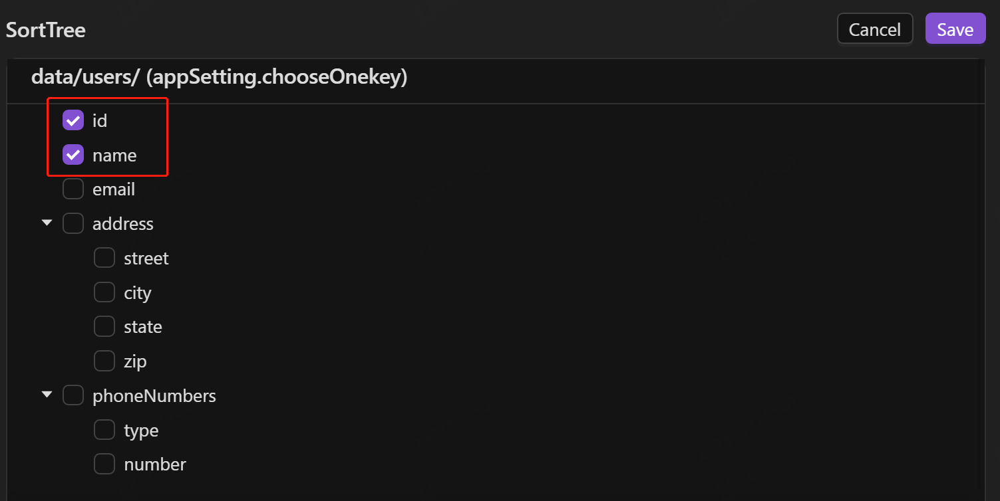

流量录制回放是通过复制线上真实流量（录制）然后在测试环境进行模拟请求（回放）验证代码逻辑正确性。

利用这种机制进行回归测试具备许多优势：

- 通过录制流量取代测试用例简单高效，易于形成丰富的测试用例，用例创建成本低；
- 回放线上流量能完美模拟用户真实行为，避免人工编写存在的差异性；另外通过对录制数据和回放数据采用对象对比方式能更深入、细微验证系统逻辑；
- 录制的流量无需维护，随取随用，非常方便。

## 快速录制应用

AREX Agent 是实现服务录制回放的核心组件，使用录制功能前需要在被测应用中配置 Agent，详见 [部署 AREX Agent](Quick%20Installation#部署-arex-agent)。

配置完成后，通过浏览器访问 AREX 前端页面，点击 **Replay**，即可在左侧菜单栏中看到已配置好的被测应用。

默认情况下，AREX 将自动录制所有时间段内的线上真实请求流量。你也可以通过录制回放设置，根据自己的需要设定录制任务。

## 录制回放设置

点击左侧菜单栏 **AppSetting** 进入录制回放设置页面。列表中显示所有的录制应用，点击相应应用进行设置。

### 录制设置

AREX 支持对特定时间段的流量进行周期性录制，你可以根据自己的需要进行自定义设置。点击 **Record**，进入录制设置页面。

#### 基本设置

Duration：设置录制应用的时间，可以选择每天都进行录制，或者仅录制一周内的任意几天的流量。

Period：设置每天录制的时间段，00:00 ~ 24:00 任意时间段均可选择。

Frequency：设置录制频率，范围为“1~100”，单位为“次/100 s”，即每 100 秒执行录制的次数。

#### 高级设置

AREX 的 Mock 功能支持非常全面，除了一些基础依赖数据的 Mock，对一些时间和本地缓存类数据也可以进行 Mock。

**Time Mock**：由于很多业务系统对时间是敏感的，不同的时间访问往往会返回不同的结果，这时可以勾选 **Time Mock**，录制过程中将对时间也进行 Mock，保证回放结果不会因为时间而出现差异。

**Dynamic Classes**：实际应用中会使用各式缓存来提升运行时的性能，为了避免由于缓存数据的差异导致的执行结果不一致的问题，AREX 也支持了本地缓存数据的采集和 Mock 功能。实现方法是将访问本地缓存的方法配置成动态类，相当于你自定义了这个方法进行 Mock，会在生产环境录制你配置的这个动态类方法的数据，回放相应的匹配出数据返回。除了缓存数据，也可以 Mock 各种内存数据。如有需要 Mock 的动态类数据，可点击 “**+ Add**”进行配置。具体配置说明如下：

- FullClassName： 本地缓存的类名，必须为全类名, 如 java.lang.String。
- MethodName： 需要 Mock 的方法名。
- ParameterTypes：所有参数的类型，需为全类名，多个以“@”分隔。primitive 类型缩写即可， 如 int。 

**ExcludeServiceOperationSet**: 这里列出的是所有在录制过程中访问到的接口路径，勾选后即可在之后的录制过程中跳过这些路径，不进行录制。

### 回放设置

点击 **Replay**，进入回放设置页面。

**Case range**：常规的回放任务可以在左侧菜单栏的 **Replay** 中通过手动开启，这里是为 CI (continuous integration) 设置用例自动回放范围，单位为 “days”。

**Exclude Operation**：如果你有一些路径不需要进行比对，可点击 “**+ Add**”添加忽略路径，回放时将跳过该条路径，提高回放效率。

### Yaml 文件配置

以上录制、回放的配置也可以通过导入 Yaml 配置文件直接进行配置。

### 忽略节点

如果响应报文中存在 timestamp、随机数、ip 等数据，即使系统代码无改动，回放结果中也会出现差异点，针对这种情况，你可以将这些节点提前进行忽略配置，减少干扰。具体配置说明如下：

**Global**：可以在这里添加该应用下的全局忽略节点，点击 “**+**” 添加需要忽略的 Key，配置完成后，该应用下的所有接口进行回放时，都将自动跳过该节点的比对。

**Interfaces**：这里可以对应用下的单个接口配置忽略节点。

1. 点击图标，在代码框内编辑该接口请求返回的响应报文，点击保存。

    

2. 保存响应报文后，界面右侧将自动展示该接口返回结果中所有的节点，直接点击需要忽略的节点即可。

    

### 节点排序

通常情况下，响应报文中的一个数组中会存在多个元素，录制、回放的响应报文中往往会出现元素前后顺序不一致的问题，导致明明是相同的返回结果，却导致回放失败。

**Nodes Sort** 可通过配置数组中元素的键，避免在回放过程中因响应报文中数组内元素排序不同而导致回放失败的问题。

1. 点击图标，在代码框内编辑该接口请求返回的响应报文，点击保存。

    

2. 保存响应报文后，界面将自动展示该接口返回结果中所有的节点。点击相应的数组名，勾选该数组下的某个或多个键作为该数组元素唯一标识的键组，并点击 **Save** 保存。勾选时应该选择能够唯一标识该数组元素的键组。

    

    

    回放测试时，AREX 将不再根据数组元素先后顺序进行一一比对，而是通过先前设定的键组在录制、回放报文中找到数组中同一元素进行比对，避免因元素顺序不一致而出现差异。

    **例**：如下所示报文，`users` 数组中含有多个元素，在请求发送后，返回结果中 `id` 为 `1` 及 `id` 为 `2` 的两个元素前后顺序是随机的，这时如果不做任何配置，AREX 将按照从前到后的顺序依次对录制与回放的响应报文进行比对，则很可能出现将录制的响应报文`users` 数组中出现的第一个元素（`id` 为 `1`）与回放的响应报文`users` 数组中出现的第一个元素（`id` 为 `2`）进行比对，导致回放失败。

    
    
    因此需要同时勾选 `id`、`name` 作为该 `users` 数组元素的唯一标识，回放时将通过 `id`、`name` 在录制与回放的响应报文中找到同一元素进行比对。如果只勾选 `name` 作为标识，那么在存在同名的情况下，仍旧会出现回放失败的结果。
    
    同理，该数组中的 `phoneNumbers` 数组也可以通过勾选 `type` 来完成配置。
