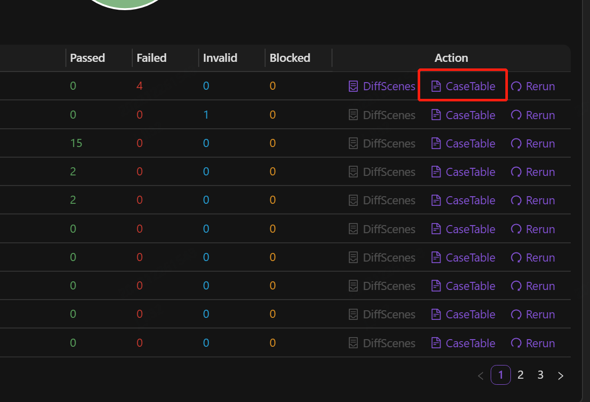
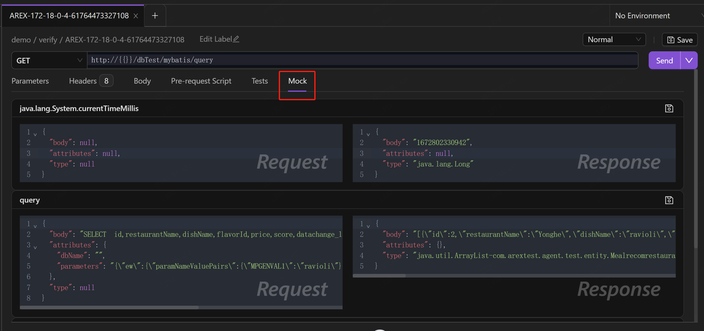

### 使用场景

1. AREX 可以将线上的真实流量录制下来从而生成丰富的测试用例，你可以根据需要将这些用例固化，扩充测试用例数量。
2. AREX 对回放用例保存的时间是有限的。对用例进行固化，长久保存，这样以后都可以对这些固化用例进行回放。

## 创建固化用例集合

首先需要创建一个集合，用于存放固化后的案例。

1. 点击 “Collection” 右侧的 “**+**” 新建一个集合。

    

2. 点击集合右侧的下拉菜单新建一个请求，用以存放之后需要固化的用例。

    

## 固化测试用例

1. 在应用录制并回放完成后，点击 **replay** 进入回放报告页面。

    

2. 点击 **Case Table** 查看录制生成的测试用例。

    

    点击 **Detail**，下方展示该用例详细信息：

    
    
    前面已经提到过，AREX 对于主接口的验证，主要是比对录制与回放后响应报文之间的差异，对于其他外部调用的第三方依赖的验证，则通过比对其请求内容进行验证。左侧为录制过程中外部调用的第三方依赖（比如数据库等）的请求内容，以及主接口的响应体。右侧则为回放过程中调用的第三方依赖的请求内容及主接口的响应体。图标表示存在差异点，图标表示无差异点。

3. 点击 Save 保存该用例，并保存至刚才新建的集合请求中。

    

## 查看固化用例

用例固化后，可以在相应的集合请求下找到，界面与请求界面相似。

点击 **Edit Label** 为该用例添加标签，进行分类，方便之后使用。

请求地址处为接口路径，如需回放调试可直接在路径前添加本地测试端口地址。

Header 中新增的 arex-record-id 为本次录制 ID，如需回放可在新建请求的请求头中添加该 arex-record-id，发送请求即可完成回放。

Mock 中是录制过程中所有从生产环境 Mock 到的数据及第三方依赖，左侧是 Mock 到的主接口及外部调用的请求报文，右侧是对应的响应报文。Mock 数据支持编辑功能，如果对 Mock 的数据不满意，可以手动修改，点击 **Save** 保存。之后在本地回放时就可以通过修改后的 Mock 数据进行请求。

