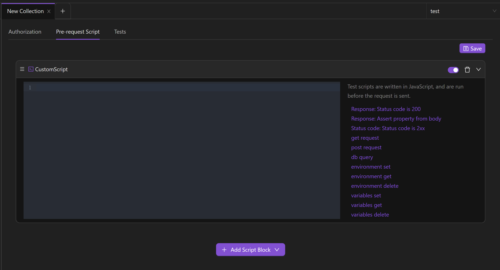
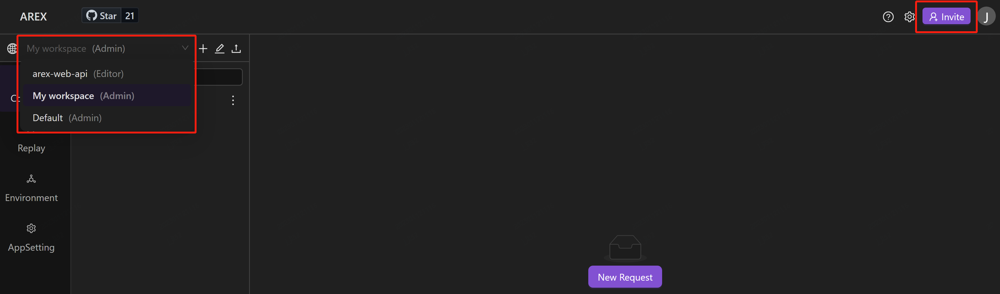

## 新建集合

通过建立集合将各类请求进行分组管理，可以帮助你更好地管理请求。

点击左侧菜单栏 **Collection** 中 **New** 按钮，新建一个集合：

或点击 “Collection” 右侧的 **+** 新建一个集合：

创建完成后，可以在左侧菜单栏管理集合。集合下还可以新增子集/文件夹。

点击集合，可以对集合进行简单编辑。

**Authorization** 可以为集合设置授权类型。如果你并不希望对外公开接口，可以使用授权，授权过程将验证你是否具有访问服务器所需数据的权限，当你发送请求时，通常需要包含参数，以确保请求具有访问和返回所需数据的权限。默认情况下，会对整个集合/文件夹下的请求生效。如需修改某一请求授权类型，可在该请求页面中单独进行修改。

**Pre-request Script** 可以为集合编写前置脚本。脚本将在此集合中的每个请求之前执行。

**Tests** 可以为集合添加测试脚本，该测试将在此集合中的每个请求之后执行。

## 新建工作区

首次登陆时将进入默认工作区。你可以创建不同的工作区供自己使用，也可以邀请你的团队在你的工作区中协作管理 Collection、共享 Environment 等。

1. 点击菜单栏右上方的 “**+**” 图标可以新建一个工作区。

    

2. 在左侧输入框中为你的工作区命名并点击 “**√**” 图标完成创建。

    

## 协作功能

AREX 提供协作功能，你可以邀请其他人加入你的工作区，在同个工作区中进行在线协作。加入工作区的成员可以共享环境、**Collection** 中测试集合及测试用例等资源。如需邀请成员加入某工作区：

1. 在左上角切换至需要进行协作的工作区。

    

2. 点击页面右上角 **Invite** 通过邮箱来邀请你的团队成员加入当前工作区。填写对方邮箱并为其设置权限后，点击 **Send Invites** 发送邀请，随后邀请人员将接收到邀请邮件，点击邮件中链接即可接受邀请，加入到工作区中。

    

    权限分为管理员（Admin）、可编辑成员（Editor）、只读成员（Viewer）三种类型。其中：
    
    - **Admin**：管理员权限，可以管理工作区中详细信息、删除工作区、并可为成员设置权限。
    - **Editor**：可以创建并编辑工作区中的资源（如测试用例）。
    - **Viewer**：不可对工作区中数据进行编辑操作，可以查看和导出工作区的资源。

3. 点击工作区右侧菜单栏的图标进入工作区设置页面。

    

    **Overview**：管理员可以在这里修改工作区的名称、查看团队成员并修改成员权限、删除工作区。

    

    **Labels**：管理员及可编辑成员可在该页面添加测试用例标签，方便管理测试用例。
    
## 新建请求

你可通过 AREX 创建并发送接口请求，进行常规测试。

若要创建新请求，可以先创建新集合，点击集合右侧下拉菜单新建一个请求：

输入接口 URL 及参数，即可快速发送请求：

