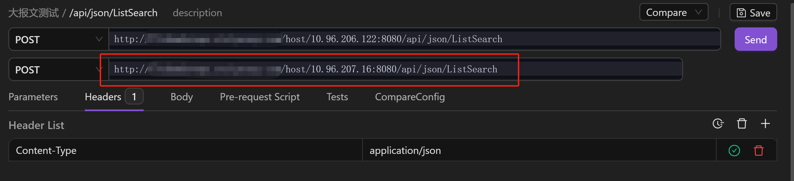

AREX 比对测试是将相同的请求报文发送至不同的接口地址，比对响应报文的差异。

## 使用场景

- 后端系统重构（或架构升级）时，对比新系统和旧系统接口返回的数据是否完全一致，用以确保系统重构没有没有带来接口问题。
- 比对新老版本接口，做验收测试。

## 比对测试

1. 新建一个集合

    

2. 新建请求

    

3. 选择请求方式，输入请求接口 URL，按照自己的需求配置好请求参数、请求头、请求体及前置脚本、后置脚本（如需要）后，点击页面右上角 **Normal** 下拉菜单中的 **Compare** 切换为比对模式。

    

    输入要进行比对的接口地址。并点击 **Send** 发送比对请求。

    

4. 请求发送成功后，在 **Compare Result** 中观察差异。

    

## 比对测试配置

比对测试中可能会存在各种干扰项（如：随机数、数组元素顺序不一致）使比对结果出现差异，增大测试人员的排查成本。这时可以提前对响应报文中的各节点进行配置，增加比对测试效率。

点击图标，在代码框内输入该接口请求返回的响应报文，点击保存。

### 忽略配置

如果响应报文中存在 timestamp、随机数、ip 等数据，即使系统代码无改动，比对结果中也会出现差异点，针对这种情况，你可以将这些节点提前进行忽略配置，减少干扰。

保存响应报文后，界面中将展示该请求响应报文中所有的节点，直接点击需要忽略的节点即可。

### 节点排序

通常情况下，响应报文中的一个数组中会存在多个元素，两个接口请求的响应报文中往往会出现元素前后顺序不一致的问题，导致明明是相同的返回结果，却显示比对结果存在差异。如下图所示：

**Nodes Sort** 可通过配置数组中元素的键（如上例中的 `id` 和 `name`）避免在比对过程中因响应报文中数组内元素排序不同而导致回放失败的问题。

保存响应报文后，界面将自动展示该接口返回结果中所有的节点（只可以对数组进行排序）。点击相应的数组名，在跳转页面中勾选该数组下的某个或多个键，并点击 **Save** 保存。勾选时应该选择能够唯一标识该数组元素的键组，如 `id` + `name`。

下次比对时，AREX 将不再按照数组元素先后顺序进行一一比对，而是通过先前设定的键组，在两组响应报文中找到数组中同一元素进行一一比对，避免因元素顺序不一致而出现差异。
