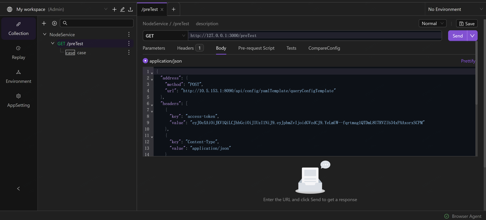
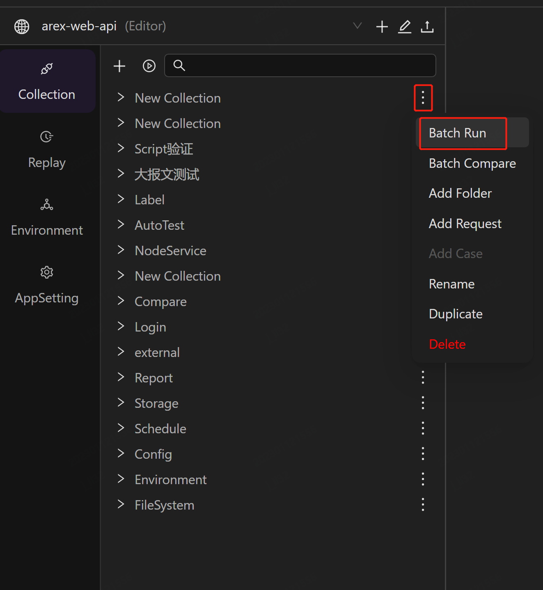
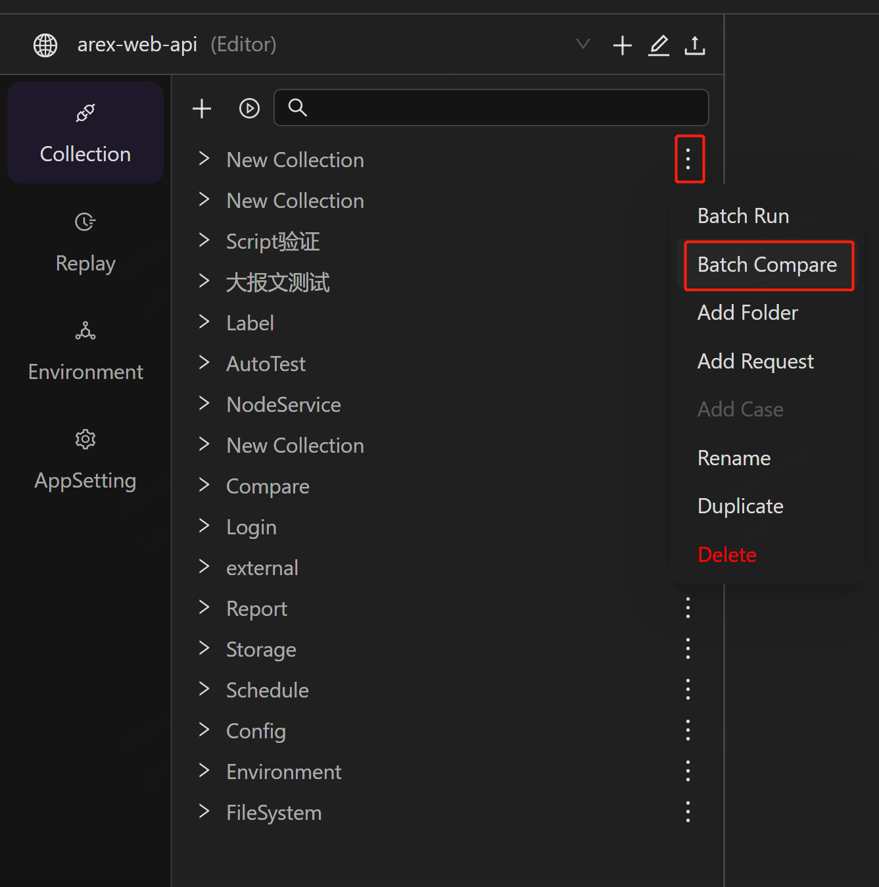

AREX 支持批量运行测试用例，通过将测试用例保存在集合中，运行集合即可。

## 使用场景

1. **批量运行常规测试用例**。当我们需要测试同一个接口的多种情况时，可以将每种情况都保存为测试用例，下次进行测试时可以直接执行测试用例，不需要重新填写请求参数等信息。AREX 支持批量运行测试用例，通过将测试用例保存在集合请求中，运行集合即可。这样可以一键测试所有测试用例，满足快速回归测试的需求。

2. **批量运行比对测试用例**。当我们需要比对新老系统两个接口响应报文的差异时，可以使用 AREX 比对测试，将相同的请求报文发送至不同环境的两个接口地址。通常，比对测试也会存在多种情况需要测试，如果每种情况都需要人工进行比对测试，测试的效率是很低的。使用批量执行比对测试的方法，可以自动化测试过程，让软件测试变得更快更高效。
    
    如果需要比对两个接口在多种情况下的响应报文差异，也可将所有的情况保存为比对测试用例，批量运行即可。

## 创建测试用例集

1. 点击 “Collection” 右侧的 “**+**” 新建一个集合。

    

2. 点击集合右侧下拉菜单 **Add Request** 新建一个请求，在跳转出的页面中填入 URL 等配置信息，点击 **Save** 保存。

    

    

3. 点击请求右侧下拉菜单 **Add Case** 新建一个常规测试用例/比对测试用例，测试用例将自动继承 Request 的配置，减少用例设计成本。

    

    

4. 点击 **Add Tag** 可为当前 Case 添加标签进行分类，方便后期管理用例。标签可在工作区设置页面进行预设。

    

5. 点击 **description** 为用例添加描述，这样可以让其他人更容易理解测试用例的目的和预期结果，提高可读性，并且能更好的把握测试内容。

## 批量运行常规测试用例

1. 选择测试用例集合下拉菜单中的 **Batch Run** 批量运行测试用例。

    

    或将鼠标移至 **Collection** 右侧的 图标，点击 **Batch Run** 批量运行测试用例。

    

2. 在打开的标签页左侧选择要执行的测试用例，点击右侧 **Run Case** 运行。

    

运行完可在下方查看测试结果。

## 批量运行比对测试用例

1. 选择测试用例集合下拉菜单中的 **Batch Compare** 批量运行比对测试用例。

    

    或将鼠标移至 **Collection** 右侧的 图标，点击 **Batch Compare** 批量运行测试用例。

    

2. 在打开的标签页左侧选择要执行的测试用例，点击右侧 **Run Comparison Cases** 运行。

    

    运行完可在下方查看每个 Case 的比对结果。

    

    将鼠标移至出现差异点的节点上，显示的是该节点在响应报文中的具体位置：

    

    若存在 timestamp、随机数、ip 等干扰数据，可点击 **Ignore Node** 对该节点进行忽略配置。